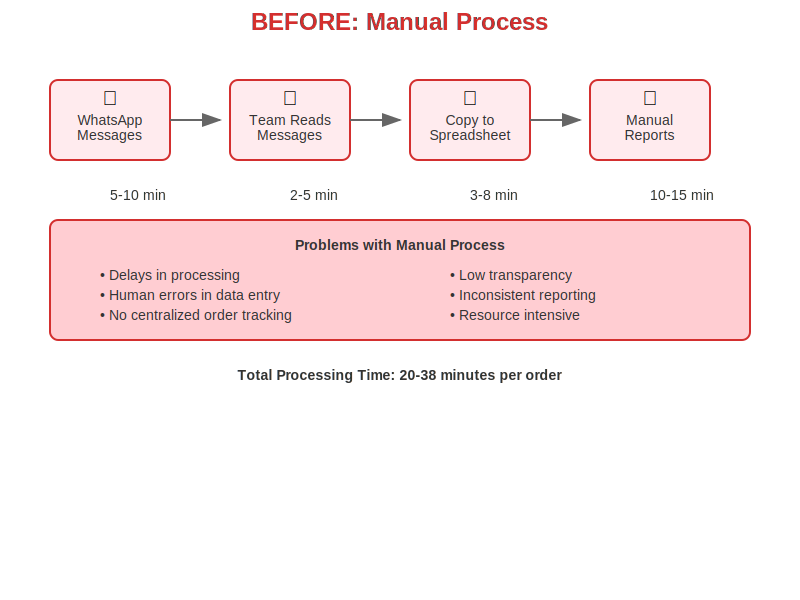
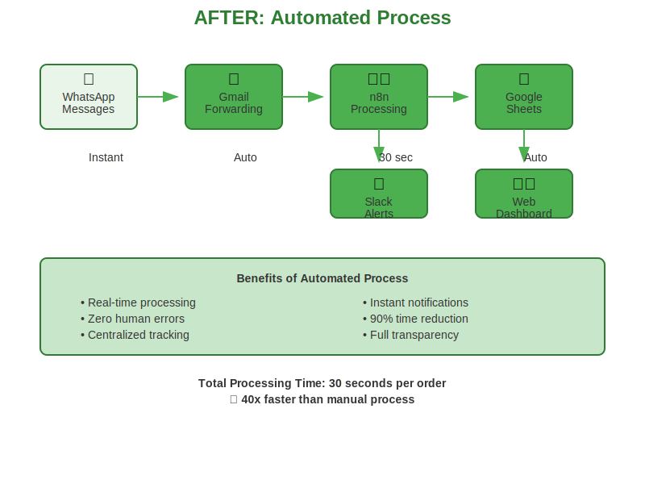
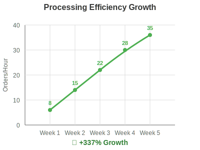

# Customer Request Automation System

## Problem Statement

We were receiving customer requests as WhatsApp messages. The old flow was: Team reads WhatsApp messages, manually copies order details into spreadsheets, manually prepares stakeholder reports, internal team had no single place to allocate orders. This caused delays, mistakes, and low transparency.

## Solution Overview

This project automates the entire customer request workflow using modern tools and APIs, providing real-time visibility and streamlined processing.

### Before vs After

#### Before (Manual Process)


- Manual WhatsApp message reading
- Copy-paste order details to spreadsheets
- Manual report generation
- No centralized order allocation
- High error rates and delays

#### After (Automated Process)


- Automated message parsing and processing
- Real-time data synchronization
- Automated stakeholder notifications
- Centralized order management
- 90% reduction in processing time

## Demo Setup

This demo uses Gmail forwarding as a bridge for WhatsApp messages. Here's how to set it up:

### Gmail Forwarding Setup
1. In WhatsApp, forward messages to your Gmail address
2. Set up Gmail filters to automatically forward to the automation system
3. The system will parse and process these forwarded messages

### Demo Features
- Real-time order processing
- Google Sheets integration
- Slack notifications
- Web dashboard for monitoring
- Growth tracking and analytics



## Quick Start

1. Follow the detailed setup instructions in [SETUP_STEPS.md](SETUP_STEPS.md)
2. Configure your Gmail forwarding
3. Import the n8n workflow
4. Deploy the webapp to GitHub Pages
5. Start forwarding WhatsApp messages to test

## Architecture

- **Input**: Gmail (WhatsApp forwarded messages)
- **Processing**: n8n workflow with AI parsing
- **Storage**: Google Sheets
- **Notifications**: Slack
- **Dashboard**: GitHub Pages hosted webapp

## Migration to Production

For production deployment, consider:

- **WhatsApp Business API**: Replace Gmail forwarding with direct WhatsApp integration
- **Database**: Migrate from Google Sheets to PostgreSQL/MySQL
- **Authentication**: Add user authentication and role-based access
- **Scaling**: Implement proper queue management and error handling
- **Monitoring**: Add comprehensive logging and alerting
- **Security**: Implement proper API security and data encryption

## Files Structure

```
├── README.md                 # This file
├── SETUP_STEPS.md           # Detailed setup instructions
├── assets/                  # SVG diagrams and images
├── webapp/                  # Frontend dashboard
├── samples/                 # Sample data files
├── n8n/                     # Workflow definitions
├── .github/                 # GitHub templates
```

## License

MIT License - see LICENSE file for details
